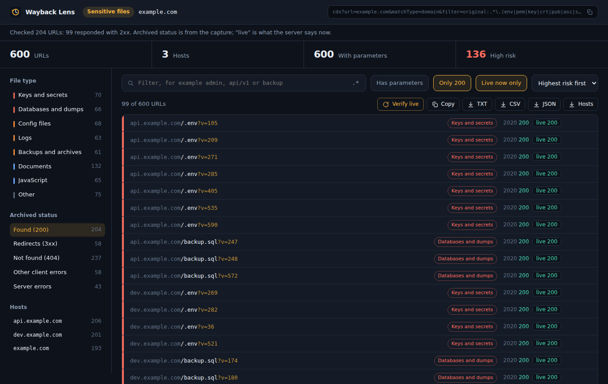
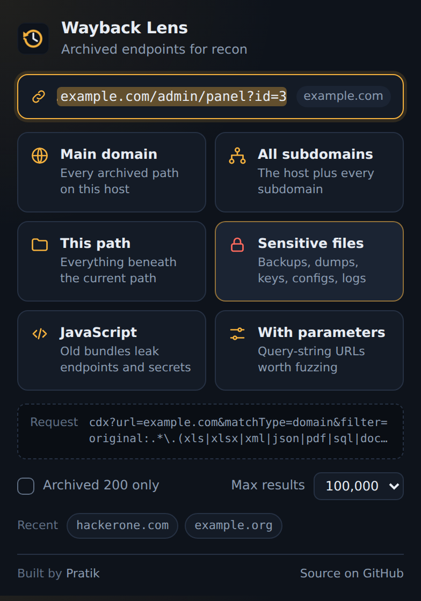

<p align="center">
  
</p>

<h1 align="center">Wayback Lens</h1>

<p align="center">
  <b>High-Performance Wayback Machine CDX Recon & Triage Workspace for Chrome (Manifest V3)</b>
</p>

<p align="center">
  <a href="https://github.com/pratik-khairnar-sec/wayback-lens/releases"></a>
  <a href="manifest.json"></a>
  <a href="LICENSE"></a>
  <a href="https://pratik-khairnar-sec.github.io/wayback-lens/"></a>
  <a href="#-privacy--zero-tracking"></a>
  <a href="#-scan-modes"></a>
</p>

<p align="center">
  <a href="https://pratik-khairnar-sec.github.io/wayback-lens/"><b>🌐 Official Landing Page & Demo</b></a> •
  <a href="#-key-features"><b>Key Features</b></a> •
  <a href="#-quick-start"><b>Quick Start</b></a> •
  <a href="#-scan-modes"><b>Scan Modes</b></a> •
  <a href="#️-keyboard-shortcuts"><b>Shortcuts</b></a> •
  <a href="#-why-wayback-lens"><b>Comparison</b></a> •
  <a href="#-privacy--security"><b>Security</b></a>
</p>

---

## 📌 Overview

**Wayback Lens** transforms the Internet Archive's public CDX API into an interactive, high-speed reconnaissance workspace right in your browser. 

Instead of dumping hundreds of thousands of raw text lines into your terminal or crashing your browser tab, Wayback Lens streams results through a non-blocking chunked decoder, autonomously prioritizes high-risk assets (`.env`, private keys, SQL dumps, `.git` trees), verifies active URLs using lightweight multi-worker HEAD requests, and exports actionable data in seconds.

<p align="center">
  
  <em>The results workspace streaming and classifying 100,000+ historical captures for example.com.</em>
</p>

---

## ⚡ Key Features

- **⚡ Non-Blocking Streaming Pipeline**: Ingests and parses 100,000+ CDX records on-the-fly using `ReadableStream` chunk decoding without freezing the UI or exhausting memory.
- **🎯 Autonomous Risk Scoring Engine**: Heuristically classifies every archived URL into security tiers:
  - 🔴 **High Risk (Risk 3)**: `.env`, AWS/SSH keys, `.git` repositories, SQL database dumps, `.bak` files, `.htpasswd`.
  - 🟠 **Medium Risk (Risk 2)**: Configuration files (`.yml`, `.ini`, `.conf`), logs, source maps (`.map`), runtime backups.
  - 🔵 **Low Risk (Risk 1)**: JavaScript bundles, PDFs, spreadsheets, documents, binaries.
- **🔬 Live 200 Multi-Worker Verification**: Sends asynchronous, user-consented HEAD probes to verify which historical endpoints still respond with HTTP 200 today. Checks high-risk targets first.
- **🧬 Faceted Triage & Regex Filtering**: Filter dynamically by file category, HTTP response status code, exact subdomain, or arbitrary regular expressions (`.*`).
- **📦 5 Multi-Format Exports**:
  - `TXT` — Clean URL list ready for `katana`, `nuclei`, or `ffuf`.
  - `CSV` / `JSON` — Structured reports with category, risk score, capture timestamp, and MIME type.
  - `Hosts` — Deduplicated passive subdomain list ready for `subfinder` or `httpx`.
  - `Copy` — One-click clipboard copy of all filtered rows.
- **🔒 Zero Telemetry & 100% Offline UI**: Strict Manifest V3 CSP, zero third-party scripts or CDNs, zero remote tracking, inline SVG sprite system. All archived URLs are strictly rendered as text to prevent client-side XSS.

---

## 📊 Why Wayback Lens?

| Feature | Wayback Lens | `gau` / `waybackurls` | Archive.org Web UI |
| :--- | :---: | :---: | :---: |
| **Interactive GUI Triage** | ✅ **Real-time Workspace** | ❌ Terminal stdout only | ❌ Static HTML list |
| **Autonomous Risk Heuristics** | ✅ **Keys, .env, SQL dumps** | ❌ Manual grep required | ❌ None |
| **Live HTTP 200 Prober** | ✅ **Built-in Multi-Worker** | ❌ Pipe to `httpx` | ❌ None |
| **Subdomain Extraction** | ✅ **1-Click Export** | ❌ Custom `awk` / `cut` | ❌ None |
| **Active Tab Auto-Target** | ✅ **Instant 1-Click** | ❌ Manual CLI flag | ❌ Manual input |
| **Streaming Large Datasets** | ✅ **Chunked stream (100k+)** | ✅ Fast stdout | ❌ Browser timeouts |
| **Privacy & Zero Telemetry** | ✅ **100% Local / MV3** | ✅ Local | ⚠️ Third-party scripts |

---

## 🔍 Scan Modes

Pick any target domain or URL (auto-detected from your active tab) and launch a targeted scan:

| Mode | Scan Type | Target Scope | CDX Request Strategy |
| :---: | :--- | :--- | :--- |
| 🌐 | **Main Domain** | Every archived path on the exact hostname | `url=host/*` |
| 🖧 | **All Subdomains** | The host and every underlying subdomain | `matchType=domain` |
| 📁 | **This Path** | Everything under the active URL path | `matchType=prefix` |
| 🔒 | **Sensitive Files** | Backups, dumps, keys, credentials, configs | `matchType=domain` + sensitive extension regex |
| 📜 | **JavaScript** | `.js` and `.mjs` bundles for API leaks | `matchType=domain` + `.m?js` filter |
| 🎛️ | **With Parameters** | Query strings formatted for fuzzing & SSRF/IDOR | `matchType=domain` + `original:.*\?.*=.*` |

<p align="center">
  
  <br><em>Hover or focus any scan button to preview the exact CDX API query prior to launch.</em>
</p>

---

## 🚀 Quick Start

### Installation (Chromium: Chrome, Brave, Edge, Opera, Arc)

1. **Clone the repository** (or [download the latest ZIP](https://github.com/pratik-khairnar-sec/wayback-lens/archive/refs/heads/main.zip)):
   ```bash
   git clone https://github.com/pratik-khairnar-sec/wayback-lens.git
   ```
2. Navigate to `chrome://extensions` in your browser.
3. Toggle on **Developer mode** in the upper-right corner.
4. Click **Load unpacked** and select the `wayback-lens` root folder.
5. Pin the **Wayback Lens** icon to your toolbar.

### Workflow
1. Navigate to any target application.
2. Click the **Wayback Lens** extension icon (the target hostname is pre-filled).
3. Select your desired scan profile (e.g., **Sensitive files** or **All subdomains**).
4. Triage results in the workspace: filter by risk, press `/` to search, or verify live 200 endpoints.
5. Export clean datasets as `TXT`, `CSV`, `JSON`, or `Hosts`.

---

## ⌨️ Keyboard Shortcuts

| Shortcut | Context | Action |
| :--- | :--- | :--- |
| <kbd>/</kbd> | Results Workspace | Focus and select the search filter input |
| <kbd>Esc</kbd> | Search Filter | Clear search input and restore view / blur |
| <kbd>Enter</kbd> | Extension Popup | Launch default domain scan on active target |
| <kbd>Tab</kbd> / <kbd>Shift+Tab</kbd> | Everywhere | Full keyboard accessibility & focus navigation |

---

## 🔒 Privacy & Zero Tracking

Wayback Lens was engineered with strict security and privacy standards:

| Permission | Technical Requirement |
| :--- | :--- |
| `activeTab` | Reads the active tab's domain to pre-fill the search box, only when you click the extension. |
| `storage` | Stores your last scan preferences and recent target history locally on your device. |
| `https://web.archive.org/*` | Directly queries the public Wayback Machine CDX API from the results tab. |
| *Optional:* `http(s)://*/*` | Requested **only** if you explicitly click **Verify live** to run HEAD status checks. Revocable anytime. |

- ❌ **No telemetry, analytics, tracking, or telemetry pings.**
- ❌ **No third-party CDN scripts or remote stylesheet dependencies.**
- 🛡️ **Safe Rendering**: All archived URLs are treated as untrusted attacker-controlled strings and rendered exclusively as safe DOM text nodes.

---

## ⚠️ Responsible Use Notice

> [!IMPORTANT]
> The Internet Archive's CDX index consists of public historical data. However, active reconnaissance and probing live hosts via the **Verify live** feature should only be conducted on targets within your designated bug bounty scope or under authorized penetration testing engagements.

---

## 📂 Project Architecture

```
wayback-lens/
├── .github/
│   └── workflows/
│       ├── ci.yml            # Automated syntax & manifest validator
│       ├── pages.yml         # Automated GitHub Pages landing page deployment
│       └── release.yml       # Production extension ZIP packager
├── docs/                     # Official GitHub Pages landing page & assets
│   ├── index.html            # Interactive cyber landing page & demo simulator
│   ├── popup.png             # UI preview asset
│   └── results.png           # UI preview asset
├── icons/                    # Hi-res extension icons (16px, 32px, 48px, 128px, 512px)
├── src/
│   ├── core.js               # CDX query builder, streaming parser, heuristic classifier
│   ├── popup.css             # Popup UI styles & micro-interactions
│   ├── popup.js              # Tab detection, target normalization, query preview
│   ├── results.css           # Workspace design system, dark palette, badges
│   ├── results.js            # Virtualized list, live prober, faceted filters
│   └── theme.css             # Shared CSS variables & design tokens
├── manifest.json             # Manifest V3 configuration & strict CSP
├── popup.html                # Extension launcher markup
├── results.html              # Dedicated results workspace markup
├── LICENSE                   # MIT License
└── README.md                 # Project documentation
```

---

## 👤 Author & Support

Crafted with care for the security and bug bounty community by:

**Pratik Khairnar**  
GitHub: [@pratik-khairnar-sec](https://github.com/pratik-khairnar-sec)

If Wayback Lens helps your recon workflow, please consider giving the repository a ⭐️ **Star**!

---

## 📜 License

Distributed under the [MIT License](LICENSE).

*Wayback Machine and Internet Archive are trademarks of the Internet Archive. Wayback Lens is an independent open-source tool and is not affiliated with or endorsed by the Internet Archive.*
